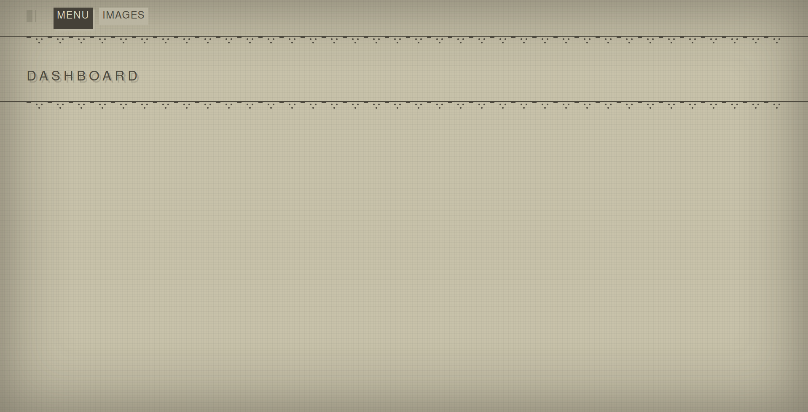

# Django-template-nierAutomata

### Module django sous forme de template inspirer de interface NierAutomata

Le module est en version Alpha.
Le système de template est basé sur les ClasseBaseView.

#### Installation du Module

Ajouter les éléments suivent dans votre fichier settings.py

```python
DJANGO_APPS= ['nierInterface']
```

## Capture

 
