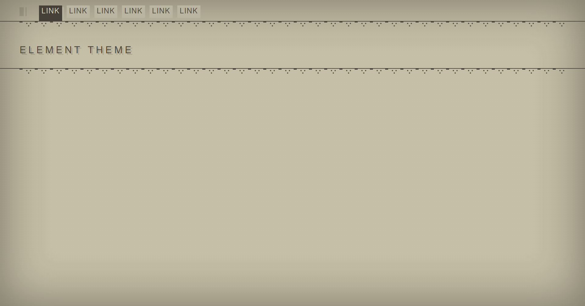

# Django-template-nierAutomata

### Module django sous forme de template inspirer de interface NierAutomata

Le module est en version Alpha.
Le système de template est basé sur les ClasseBaseView.

#### Require

-   django >= 3

#### Installation du Module

Ajouter les éléments suivent dans votre fichier settings.py

```python
DJANGO_APPS= ['nierInterface']
```

Ajouter les imports dans votre views.py pour utiliser le theme

```python
from nierInterface.generic import TemplateView ,ListView ,CreateView, DeleteView, modal
```

## Capture



## Modal


Use Modal

```html

<a class="btn" href="{{url}}" data-target="{{url}}#modal" data-toggle="modal">title btn</a>
```
